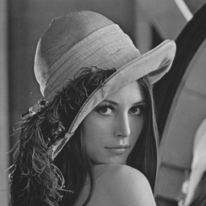
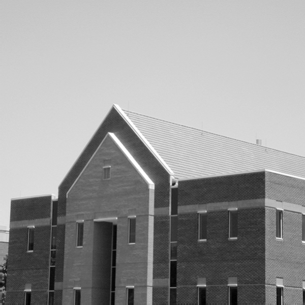
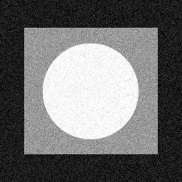

# 数字图像处理试题
***
## 要求：写出每个所选题目的：①程序(对主要算法程序段进行每行注释)，②运行结果，③运行结果分析。
***
### 1. 选取大小为256*256，“LENA.bmp”分别进行自编直方图均衡处理和自编直方图规则化处理，写出算法思想，主要程序段，实验结果分析。

***
### 2. 在给定的应用中，一个空域均值滤波器模板被用于输入图像以减少噪声，然后再用一个拉普拉斯模板来增强图像中的细节。如果交换这两个步骤的顺序，结果是否会相同？请写出算法思路，主要程序段，并对实验结果进行分析。
***
### 3. 对一幅灰度图像“LENA.bmp”分别添加椒盐噪声和方差为0.02的高斯噪声，再使用自编均值滤波器，自编中值滤波器和自编自适应中值滤波器对图像进行处理，请写出算法思路，主要程序段，并对实验结果进行分析。
***
### 4. 将10个离散点（1, 0），（2, 3），（4, 6），（3, 2），（5, 1），（6， 3），（7, 4），（8, 5），（9, 4），（10, 2）投射到直角坐标系中，然后在hough空间内找到共线交点，利用自编hough变换求出这10个离散点的边缘直线段。并将下面一幅图像分别利用prewitt, otsu, Hough变换三种方法求出图像的边缘，请写出算法思路，主要程序段，并对实验结果进行分析。

***
### 5. 利用下面这幅含噪声图像，提取它的一部分图像进行直方图统计，选择合适的滤波器对这幅图像进行复原操作，请写出算法思路，主要程序段，并对实验结果进行分析。

***
### 6. 选取大小为256*256，“LENA.bmp”进行离散傅里叶变换，并进行中心点平移。在进行中心平移后，以直流分流所在中心为原点，分别获取25*25、50*50、100*100的正方形频率子带进行逆傅里叶变换，分析不同大小的正方形频率子带对空域图像恢复有什么影响？从而得知不同的频率子带包含有什么信息？这种规律是否可以用于图像压缩？请写出算法思路，主要程序段，并对实验结果进行分析。

***
### 7. 将平滑参数𝛔设为可变参数，用于控制LOG边缘检测算子，通过实验说明平滑参数𝛔与边缘检测图像之间的关系。
***
### 8. 设计程序确定在LOG算子中的二阶导数过零点，并解释为什么如果只使用过零点定义的像素来表示边界，边界有可能不连续，提出并实现提供连续边界的改进方法。
***
### 9. 对基于经典超分辨率重构方法进行研究，并利用深度学习的方法对低分辨率图像进行重构。
***
### 10. 对基于经典去雾算法进行研究，利用深度学习的方法用于去雾处理。